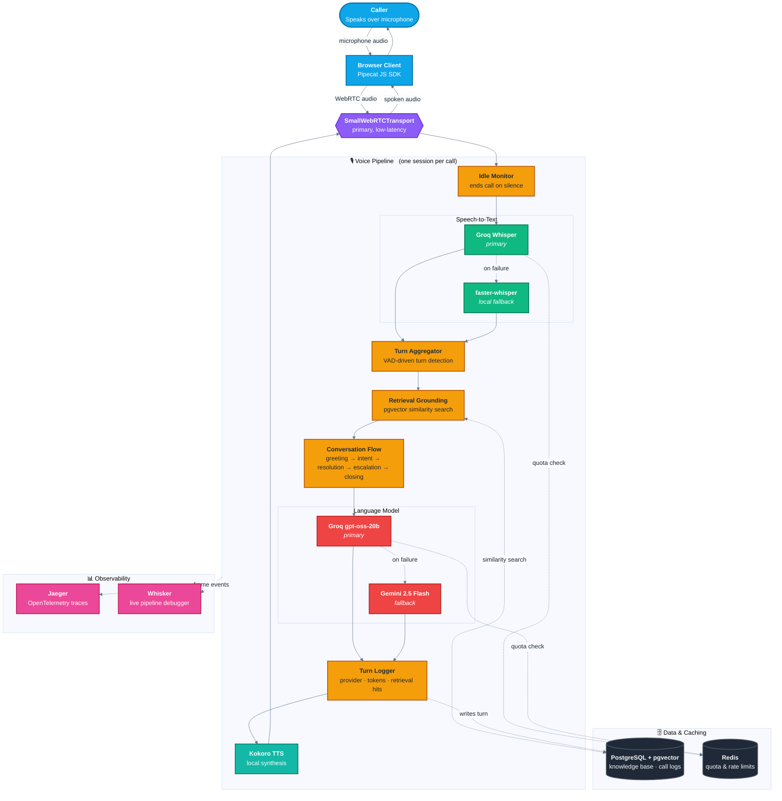

# VoiceDesk

**A real-time, low-latency AI voice agent for e-commerce customer support.**

Built on [Pipecat](https://github.com/pipecat-ai/pipecat), the open-source
Python framework for voice and multimodal conversational agents, VoiceDesk
demonstrates a production-grade architecture for AI-driven voice support:
provider failover, retrieval-grounded responses, explicit conversation-state
management, observability, and security, all assembled from free and
open-source components with a clear upgrade path to paid services.

---

## Overview

VoiceDesk is a streaming voice pipeline that lets a caller speak naturally
to an AI support agent from a web browser and receive a spoken, grounded
answer in return. Rather than a request-response chatbot bolted onto a
text-to-speech engine, it is built as a continuous, low-latency pipeline:
audio flows in over WebRTC, is transcribed as the caller speaks, is answered
by a language model grounded in a real customer support knowledge base, and
the answer is streamed back as speech, with the caller free to interrupt at
any point, the same way a real support line behaves.

The project is deliberately built for reliability under real-world
constraints. Every provider in the pipeline, speech recognition, the
language model, and speech synthesis, has a fallback path that keeps the
call running when a provider is unavailable, rate limited, or misconfigured,
without the caller noticing an interruption.

## Objectives

- Deliver a voice support experience indistinguishable in responsiveness
  from a well-run human support line: natural turn-taking, mid-sentence
  interruption, and a spoken response grounded in real support content.
- Keep the entire stack runnable on free and open-source components during
  development, while keeping every provider swappable for a paid upgrade
  later without rewriting the agent.
- Treat provider failure as an expected condition, not an edge case: every
  external dependency, speech recognition, language model, and text
  synthesis, has a tested fallback, and the call continues transparently
  when the primary provider fails.
- Model the support conversation explicitly, greeting, intent capture,
  grounded resolution, clarification, and escalation, rather than leaving
  conversational structure implicit in a single long prompt.
- Build in observability and security from the start: per-turn latency
  tracing, structured session logging, authenticated connections, and rate
  limiting are part of the architecture, not an afterthought.

## What We Build

- **A streaming voice pipeline** (`bot.py`, `src/voicedesk_voice/`) that
  chains speech-to-text, retrieval, a language model, and text-to-speech
  into a single low-latency, interruptible conversation, orchestrated by
  Pipecat.
- **A dual-provider failover layer** for both speech recognition (Groq
  Whisper, with a local faster-whisper fallback) and the language model
  (Groq, with a Gemini fallback), each backed by a Redis-tracked request
  budget and automatic recovery.
- **A retrieval-grounded knowledge base** (PostgreSQL with pgvector) built
  from a real customer support dataset, queried on every turn so the
  agent's answers are drawn from actual support content rather than
  invented.
- **An explicit conversation flow** (Pipecat Flows) covering greeting and
  identity capture, intent capture, grounded resolution, a bounded
  clarification loop, escalation to a human agent, and closing.
- **A browser client** (`client/`), a Pipecat JavaScript SDK application
  with call controls, a live transcript, a speaking indicator, and
  automatic reconnect handling.
- **Observability and security infrastructure**: OpenTelemetry tracing to
  Jaeger, a live pipeline debugger (Whisker), JWT-authenticated connections,
  per-IP rate limiting, call duration and idle-silence limits, and opt-in
  transcript storage.
- **A test suite, a production Dockerfile, and a CI workflow**, so the
  provider router, the retrieval module, and the conversation flow are all
  independently verifiable, and the project is deployable as a container
  with tests enforced on every pull request.

## How It Helps

- **For callers**, the experience matches a competent human support line:
  natural speech, the ability to interrupt, and answers grounded in real
  support content rather than a generic model response.
- **For the business**, phone support is normally the most expensive
  support channel to staff; this architecture handles routine questions
  automatically and escalates only what genuinely needs a person, with a
  structured summary already prepared for the human agent.
- **For reliability**, no single provider outage or rate limit takes the
  agent down: speech recognition and the language model both fail over
  automatically, and the call continues without the caller noticing.
- **For operators**, per-turn tracing and structured session logging mean
  slow stages and failure patterns are visible and diagnosable, and voice
  performance can be reported alongside a text support channel in the same
  analytics dashboard.
- **For engineering**, every component is swappable and independently
  testable, so moving from free-tier providers to paid ones, or extending
  the conversation flow, does not require rearchitecting the agent.

## Architecture

The pipeline runs as one Python process per active call. A caller's audio
enters over WebRTC, moves through speech recognition, retrieval-grounded
language model reasoning, and speech synthesis, and returns as spoken audio,
with every provider stage backed by a fallback and every turn logged for
observability.



**Legend.** Blue marks the caller and client, purple the transport layer,
green the speech-to-text stage, amber the conversation-flow and grounding
stages, red the language model stage, teal text-to-speech, dark gray the
persistent data stores, and pink the observability tooling. Solid arrows
trace the primary path audio and data take through a turn; dashed arrows
mark fallback routing, quota checks, and asynchronous writes.

Conversation structure, greeting and identity capture, intent capture,
knowledge-base-grounded resolution, a bounded clarification loop, escalation,
and closing, is modeled as an explicit state machine with Pipecat Flows (see
`src/voicedesk_voice/call_flow.py`). Retrieval grounding is only active on
the resolution and clarification nodes.

## Prerequisites

- Python 3.12 and [uv](https://docs.astral.sh/uv/)
- Docker and Docker Compose, for PostgreSQL (pgvector), Redis, and Jaeger
- Node.js 18 or later, for the browser client
- A Groq API key and a Gemini API key (both free tier). Neither is strictly
  required to run the pipeline, since local fallbacks exist for speech
  recognition and text-to-speech, but at least one working LLM key is
  required for the agent to actually respond (see "LLM Provider Keys and
  Fallback" below).

## Local Setup

Clone the repository, then from its root:

```bash
uv sync
cp .env.example .env
```

Edit `.env` and set at minimum `GROQ_API_KEY` and/or `GEMINI_API_KEY`. Leave
the rest at their defaults for local development.

Start the supporting services:

```bash
docker compose up -d
```

This starts PostgreSQL with pgvector on port 5433, Redis on port 6380, and
Jaeger (trace viewer UI at http://localhost:16686) with its OTLP endpoint on
port 4317. The schema is applied automatically on first start; if you add
new tables to `db/schema.sql` after the volume already exists, apply them
with:

```bash
cat db/schema.sql | docker exec -i pipecat-voicedesk-postgres psql -U voicedesk -d voicedesk
```

## Knowledge Base Ingestion

The agent grounds its answers in the Bitext customer support dataset (see
"Licensing" below). Download, clean, and load it, then generate embeddings:

```bash
uv run python scripts/load_support_kb.py
uv run python scripts/generate_embeddings.py
```

The first run downloads the dataset (about 27,000 instruction/response
pairs) and the embedding model (`BAAI/bge-small-en-v1.5`, run locally, no
API key). Re-running `load_support_kb.py` reuses the already-downloaded CSV
in `data/raw/`; delete it to force a fresh download.

## Running a Local Call

Start the bot:

```bash
uv run bot.py
```

This serves both the WebRTC transport (for the browser client) and the
WebSocket transport (for the scripted test client below) on port 7860.

Start the browser client in a separate terminal:

```bash
cd client
npm install
cp env.example .env
npm run dev
```

Open the printed local URL (typically http://localhost:5173), click **Start
call**, and allow microphone access.

To test without a browser or microphone, use the scripted client, which
drives the WebSocket transport with synthetic caller audio:

```bash
uv run python scripts/generate_test_audio.py   # once, to synthesize test WAVs
uv run python scripts/voice_smoke_test_client.py
```

That script exercises the STT failover, the round trip, and interruption
handling, and prints its own pass/fail results. Note that the caller's
transcript itself never reaches this client (the browser client's RTVI
transcript events do show it, but the raw WebSocket protocol does not);
correctness of a specific transcript is easiest to confirm against the
bot's own log (`grep "Transcription:"`).

## LLM Provider Keys and Fallback

Set `GROQ_API_KEY` and `GEMINI_API_KEY` in `.env` to enable the two LLM
providers. Groq is checked first for every turn; a real API error (invalid
key, rate limit, exhausted quota) or this project's own Redis-tracked
requests-per-minute budget being reached marks it unusable and the pipeline
fails over to Gemini for subsequent turns, recovering back to Groq after a
cooldown (`LLM_PROVIDER_RECOVERY_SECS`, 60 seconds by default). The same
pattern applies to speech-to-text: Groq Whisper is primary, and a local
faster-whisper model (no API key, no rate limit) is the fallback.

Fallback behavior is covered by an automated test that simulates a
rate-limited Groq response without needing real credentials:

```bash
uv run pytest tests/test_llm_failover.py -v
```

To confirm it manually against the real APIs, temporarily set an invalid
`GROQ_API_KEY` (or exhaust `GROQ_LLM_RPM_LIMIT`) and watch the bot's log for
`LLM failover: now using GeminiLLMServiceWithQuota`.

## Conversation State and Escalation

The call is modeled as an explicit flow (`src/voicedesk_voice/call_flow.py`):
greeting and identity capture, intent capture, knowledge-base-grounded
resolution, a clarification loop bounded by `MAX_CLARIFICATION_ATTEMPTS`
(2 by default), escalation, and closing. A clarification loop that exceeds
its attempt limit escalates automatically. Escalation writes a structured
summary, caller name, intent, reason, and attempt count, to the
`escalations` table; it does not store a raw transcript dump.

## Observability and Debugging

Per-turn OpenTelemetry traces, broken down into child spans for STT,
retrieval, and LLM calls, export to Jaeger. View them at
http://localhost:16686 (search for service `pipecat-voicedesk`).

[Whisker](https://whisker.pipecat.ai), a live pipeline debugger, is
available while a call is active at `ws://localhost:9090`. Open
https://whisker.pipecat.ai and point it at that address to watch frames
move through the pipeline in real time. Both tracing and Whisker are
dev-only and can be disabled with `ENABLE_TRACING=false` and
`ENABLE_WHISKER=false`.

Structured session-level logging (start time, end time, turn count,
providers used, escalation outcome) is written to `call_sessions` for every
call, so voice agent performance can be reported alongside a text chat
product's in the same analytics dashboard.

## Known Latency Characteristics

Measured in this development environment (CPU only, no GPU) with the local
fallback services active, since no cloud API keys were configured while
building this project:

| Stage | Typical latency |
|---|---|
| Local faster-whisper transcription (distilled medium model) | 2 to 6 seconds for a short utterance |
| Kokoro local TTS, time to first audio | 0.7 to 0.9 seconds |
| Retrieval (embed query and pgvector search) | Well under 100 ms |
| Full round trip, local Whisper fallback and Kokoro | Roughly 5 to 10 seconds |

With the cloud providers (Groq Whisper, Groq or Gemini LLM) actually
reachable, expect substantially lower latency: Groq's hosted Whisper and
`gpt-oss-20b` are both optimized for low time-to-first-token, and are the
primary path specifically because they are faster than the local fallbacks.
Verify current figures in your own environment and with your own provider
accounts; rate limits and latency on free tiers change over time.

## Security and Reliability

- The client connection can require a signed JWT (`REQUIRE_AUTH=true`,
  `JWT_SECRET` set). In the full platform this token comes from the existing
  login session; standalone, issue a test token with
  `uv run python scripts/issue_dev_token.py`.
- New call sessions are rate limited per client IP
  (`CALL_START_RATE_LIMIT` per `CALL_START_RATE_WINDOW_SECS`), to protect
  free-tier STT/LLM quotas from a single source.
- A call ends cleanly after `MAX_CALL_DURATION_SECS` (15 minutes by default)
  or `MAX_IDLE_SILENCE_SECS` (30 seconds by default) of caller silence,
  whichever comes first.
- The caller's and agent's spoken text is stored by default only as a
  length, not the words themselves, since spoken conversations can include
  sensitive personal information. Set `STORE_FULL_TRANSCRIPTS=true` to opt
  in to storing the full text.

## Testing

```bash
uv run pytest
```

Covers, independently of the audio pipeline: the retrieval module, the LLM
provider router's failover behavior (including a simulated rate limit, using
Pipecat's own pipeline test harness), the Pipecat Flow's state transitions,
JWT authentication, the Redis-backed rate limiters, and the transcript
storage opt-in.

Interruption handling, escalation triggering, and provider fallback were
additionally verified manually against a live pipeline and a real headless
browser (WebRTC, with a synthetic microphone feed) during development; see
the pipeline's own log output for the exact events (`broadcast_interruption`,
`STT failover`, `LLM failover`) during any real call.

A full end-to-end pass over representative support questions, verifying the
final transcript, a retrieval hit, and a synthesized spoken response for
each, needs at least one real, working LLM provider key; it was not run in
the sandboxed environment this project was originally built in, since
neither provider key was available there. The retrieval half of that check
does not need an LLM and was verified directly during knowledge base
ingestion: querying "How can I get a refund for my order?" against the
loaded `support_kb` returned matches with 0.83 to 0.84 cosine similarity.

## Deployment

Build the production image from the project root:

```bash
docker build -t pipecat-voicedesk-bot .
docker run --rm -p 7860:7860 --env-file .env pipecat-voicedesk-bot
```

The image installs several large ML dependencies (PyTorch, ctranslate2,
onnxruntime), so the first build pulls a few gigabytes and can take a while
depending on your connection; it was authored and its apt package names
confirmed correct by running real builds during development, but a full
build to completion was not finished in the sandboxed environment this
project was built in, due to a slow connection there. Build it once
yourself before relying on it, and report any issue against the exact
package versions in `uv.lock`.

To deploy the backend to a free tier of Render or Railway, point
`DATABASE_URL` and `REDIS_URL` at managed or otherwise reachable Postgres
and Redis instances, set the provider API keys and `JWT_SECRET`, and expose
port 7860. WebRTC in particular needs its ICE/STUN traffic to actually
reach the container: most platforms handle this transparently for a single
container reachable on a public IP, but if calls connect and then
immediately drop, check whether the platform requires a TURN server for
UDP traffic through its load balancer (see Pipecat's own deployment guide
for current, platform-specific detail), and pass `--host 0.0.0.0` (already
the container's default command).

Deploy the browser client as a static build:

```bash
cd client
npm run build
```

Serve the resulting `client/dist/` alongside the rest of the platform's
frontend, with `VITE_BOT_START_URL` pointed at the deployed backend's
`/start` endpoint.

A GitHub Actions workflow (`.github/workflows/test.yml`) runs the test
suite on every pull request and push to `main`.

## Licensing

- Pipecat (`pipecat-ai`) is licensed under the BSD 2-Clause License.
- The Bitext Customer Service Tagged Training Dataset for LLM-based Chatbots
  (`bitext/Bitext-customer-support-llm-chatbot-training-dataset` on Hugging
  Face) is published under the Community Data License Agreement, Sharing,
  Version 1.0 (CDLA-Sharing-1.0), as of this writing. Verify the current
  license on the dataset's Hugging Face page before any commercial use, as
  dataset licensing can change independently of this repository.
